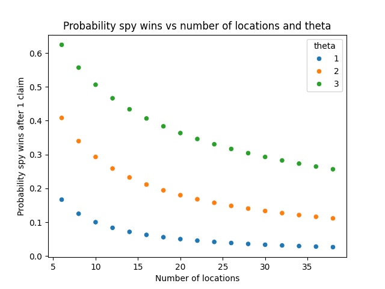
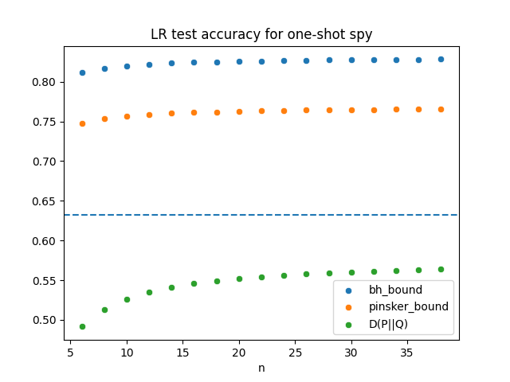
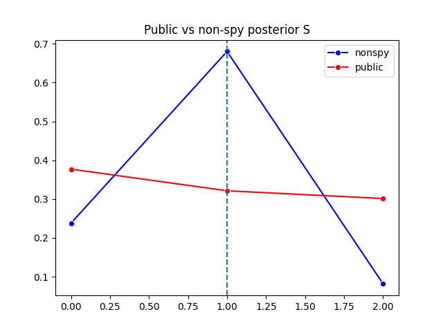
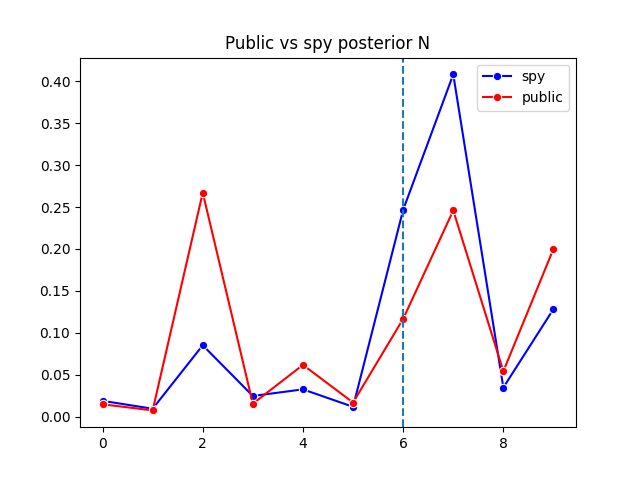
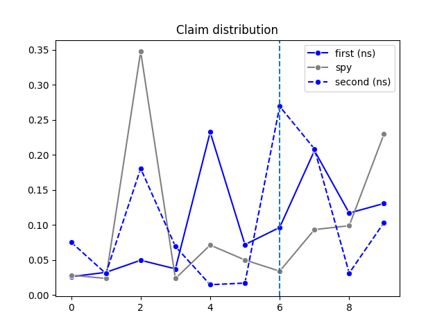
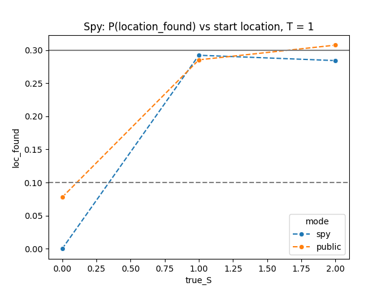
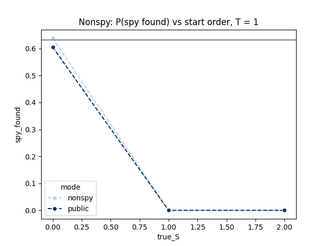
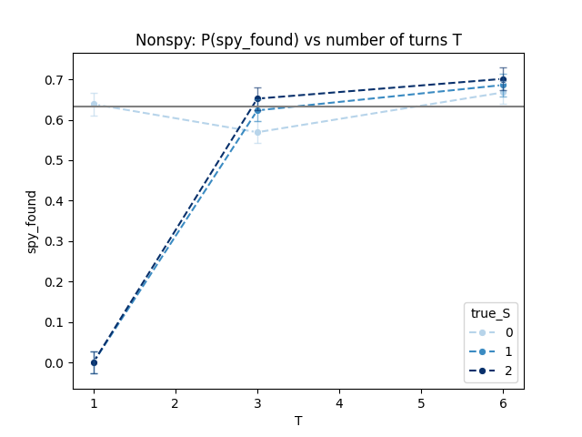
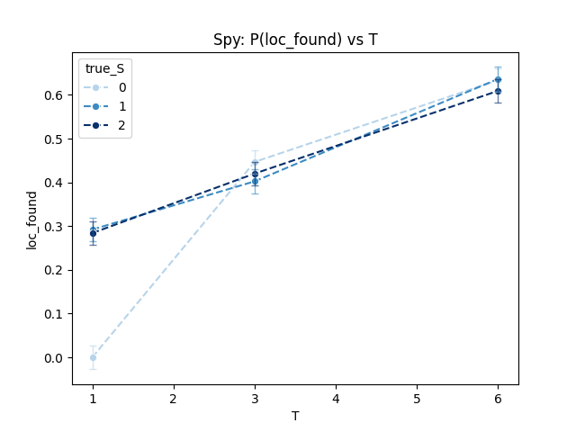

# Spyfall in Pyro: Model and implementation notes

## Game rules

The game has $s$ players with $n$ possible locations. A location and a player is chosen at random

$$N \sim Unif(1, \dots, n), \quad S \sim Unif(1, \dots, s).$$

Players who are not the spy knows the location $N$ but not $S$, player who is the spy knows $S$ but not $N$. The spy wants to find the location $N$, the non-spy players want to find the spy $S$. 

Each turn $t = 1, 2, \dots$, a designated player $j_t \in [s]$ publicly announces a claim $C_t$ that is a probability vector over locations

$$ C_t \in \Delta_{n-1}. $$

At any turn, any player can trigger a game-ending move. 
* The spy can name the location. If correct, then the spy wins. Otherwise, the non-spy team wins. 
* A non-spy can trigger a collective (majority vote) to name the spy. If correct, AND if the spy cannot name the location (this serves as "conclusive proof" that they are indeed the spy), then the non-spy team wins. Otherwise, the the spy wins (though in the codes we record this as a "tie" when we test out strategies). 

# Spyfall as a probabilistic program

For a first implementation, we make some simplifying assumptions. These can be relaxed to add more human-like dynamics later.  

1. **Direct communication with no errors.** Players communicate over $\Delta_n$ directly, and if a player intends to send out $C_t$, then everyone else receives $C_t$ and not a noise-corrupted version of it. In reality, people communicate with words that describe the location, which then adds two things: (i) a translation (NLP) to (probability) layer, and (ii) an encode/decode layer, which potentially makes the received message different from the sent message. 
2. **Automatic end-game trigger.** Game ends when either:
  - spy is very confident (> 90%) of the location, OR
  - everybody's except the spy top suspect is the same person (which could be wrong)

Then a vote is triggered, and players vote for the most-likely candidate (spy or location) based on their private beliefs.   

## The generative model

The model is the key specification of a probabilistic program. We want a "global model" that **all players** will use, where making claims is drawing a sample, and "processing others claims" is running inference, and we want to use ``pyro``. 

Our model is this. Let $N,S$ be the latent globals random variables, 
$$
  N\in\{1,\dots,n\},\quad S\in\{1,\dots,s\}.
$$
Over $T$ turns, we observe
$$
  \{(j_t,C_t)\}_{t=1}^T,
  \quad j_t\in\{1,\dots,s\},\;
  C_t\in\Delta_{n-1},
$$
where $j_t$ is the index of the speaker of that round, and $C_t$ is his claim. At round $t$, let $\pi_t \in \Delta_{n-1}$ be the initial spy's prior over the locations. We model the claim distribution emitted at by speaker $j_t$ as a Dirichlet, with concentration parameter

$$
\alpha(j_t) = 
\begin{cases}
  \big(\mathbf{1} + (\theta-1) \mathbf{e}_N\big) & \text{if } j_t \neq S \\
  \big(\mathbf{1} + (\theta-1) \pi_t\big) & \text{if } j_t = S
\end{cases} \quad  \in \Delta_{n-1}.
$$

After turn $t$, if the spy didn't speak that turn, the spy does a posterior update of his belief with Bayes' rule
$$
\pi_{t+1}(k) = \begin{cases} 
\pi_t(k) & \text{if } j_t = S \\
\propto \mathbb{P}(C_t | N =k)\pi_t(k)
\end{cases},
$$
where $P(C_t | N = k)$ is the Dirichlet with concentration $\alpha = \big(\mathbf{1} + (\theta-1) \mathbf{e}_k\big)$ above. 

### Interpretations: $\theta$ as strategy parameter

Here, $\theta$ is how much we information to reveal and it forms our "strategy" or "personality" of the player. This latent parameter can be learned by `pyro`. Higher $\theta$ means we reveal more information about our true belief, smaller $\theta$ means we emit vague, or even wrong claim opposite our belief (when $\theta < 1$).  

The reason we choose this parametrization is that the Dirichlet is the normalization of a $Gamma(\theta, 1)$ and a bunch of independent exponentials $exp(1)$. Then $\theta$ is an integer, in particular, it is easy to do exact computations. (See the **Puzzle** section below). 

# Spyfall through the lens of Probability and Information Theory

The problem is small enough that we can analyze its behavior analytically. This turned out to be a really nice exercise with some interesting math puzzles. 

Note that our claim $C_t \in \Delta_{n-1}$ of a non-spy is the normalized version of the vector $(X_1, \cdots, X_n) \in \mathbb{R}^n$, where $X_i$'s are independent, and 
$$ X_i \sim 
\begin{cases}
exp(1) & \text{if } i \neq N \\
Gamma(\theta, 1) & \text{if } i = N \\
\end{cases}.
$$ 
Now suppose that $\theta \in \mathbb{N}$ is an integer. Then we get an even better representation: take a sequence of $n+\theta-1$ i.i.d $exponential(1)$, sum up the first $\theta$, that is our $X_N$, while the rest are the other $X_i$'s. 

Now we are ready to derive some interesting formulas. 

## Can the spy pins down the location after just one claim?

Suppose $T = 1$ and the speaker is a nonspy, so the speaker reveals $(X_1, \dots, X_n)$. If the game ends immediately and the spy is forced to make a best-guess of the location $N$, then clearly it should guess the index $i$ where $X_i$ is largest, ie
$$ \hat{N} = argmax \{X_i, i = 1, \dots, n\}. $$

Then the spy's probability of being correct is
$$ \mathbb{P}(\hat{N} = N) = \mathbb{P}(Gamma(\theta,1) > \max_{i=1,\dots,n-1} \epsilon_i) = \mathbb{E}((1-e^{-X})^{n-1}), $$
where $X \sim Gamma(\theta,1)$, and $\epsilon_i$ are i.i.d $exponential(1)$. 

### Theorem 1. Spy win probability after 1 claim
**Theorem 1.** Denote the spy's win probability by $F(\theta,n)$. Then this function satisfies the following recursion 
<!-- in $\theta$
$$ F(\theta,n) = \frac{1}{\theta-1} \sum_{i=1}^{\theta-1} H_n^{(\theta-i)} F(i, n) \quad \text{for } \theta \geq 2, $$
where $H_n^{(m)} = \sum_{j=1}^n j^{-m}$. It also satisfies the following recursion in $n$ -->
$$ F(\theta,n) = \frac{1}{n}\sum_{i=1}^nF(\theta-1,i),  $$
with initial conditions
$$ F(1,n) = \frac{1}{n}, F(\theta,1) = 1.$$

---

### Implication: For $N = 10$ locations, spy has about 30% of winning after just one claim!

Let's look at some example values for $\theta$
* $F(1,n) = \frac{1}{n}$. The claim has zero information, spy's win probability is always $1/n$ (randomly guess a location). 
* $F(2,n) = \frac{H_n}{n} \sim \frac{\log n}{n}$, where $H_n = \sum_{i=1}^n \frac{1}{i}$ is the $n$-th harmonic number. This grow of $(\log n)/n$ is pretty slow. 
* $F(3,n) = \frac{1}{n} \sum_{i=1}^n H_i/i = \frac{1}{n} \frac{1}{2} (H_n^2 + H_n^{(2)}), $
where $H_n^{(2)} = \sum_{k=1}^n \frac{1}{k^2}$. Asymptotically, this is $\frac{(\log n)^2}{2n}.$ Still pretty small. 

Now, realistically the game has small $n$ (would be really hard for humans to play otherwise), so $H_n^2$ can still have a significant contribution. Indeed, if $\theta = 3$, and the number of locations $n = 10$, then after just **one claim**, the spy has a 50% of winning!

Below, we ran simulation with $\theta = 2$. That should give the spy the 30% chance of winning after the first claim. 

---

**Aside. GPT and proofs**  GPT current best math model (o4) can give you a brute-force computation riddled with **subtle** errors. It couldn't derive the above recursion. LLMs, in my opinion, are mass-copy machines. It's (still) abysmal at coming up with something original. 

I had a lot of fun writing the man-made $\copyright$ proof below. It's not difficult, just an undergrad-level argument, but it is such a treat to discover it, like spotting a beautiful shell on the beach. But the experience is tinged with sadness as well, for the moment the shell is made, it will be fed to the LLM shredder, reassembled and served on demand. The next generations will be denied the opportunity to discover such simple beauty. 

**Proof of Theorem 1.** Introduce i.i.d $exponential(1)$ random variables $E_1, \dots, E_{\theta-1}$ and $Y_1, \dots, Y_n$. Our problem is to compute
$$ F(\theta,n) = \mathbb{P}(E_1 + \dots E_{\theta-1} + Y_1 > \max_{i=1,\dots,n} Y_i). $$
Now, take the $Y_1, \dots, Y_n$, and let $O_n < O_{n-1} < \dots < O_1$ be their order statistics, ie $O_n$ = smallest $Y_i$'s, $O_1$ = largest $Y_i$. Then we can write the $O_i$'s as partial sums of the sequence $(Z_n, Z_{n-1}, \dots, Z_1)$ where $Z_i \sim exponential(i)$ and the $Z_i$'s are independent. That is, 
$$
\begin{align*}
O_n &= Z_n, \\ 
O_{n-1} &= Z_n + Z_{n-1} \\
O_{n-2} &= Z_n + Z_{n-1} + Z_{n-2} \\
\vdots \\
O_1 &= Z_n + \dots + Z_1.
\end{align*}
$$
In particular, 
$$O_1 = O_i + (Z_{i-1} + \dots + Z_1) \stackrel{d}{=} O_i + M_{i-1}$$ 
where $M_{i-1} = \max_{j=1,\dots,i-1}\{W_j\}$ is the max of $i-1$ independent standard exponentials, independent of $O_i$. 

We can now write our problem as
$$ F(\theta,n) = \mathbb{P}(E_1 + \dots E_{\theta-1} + Y_1 > M_{n-1}) = \mathbb{P}(E_1 + \dots E_{\theta-1} + Y_1 > O_1). $$
Now, let's condition on the event that $Y_1 = O_i$ (that is, $Y_1$ is the i-th order statistic). Then 
$$ 
\begin{align*}
\mathbb{P}(E_1 + \dots E_{\theta-1} + Y_1 > O_1 | Y_1 = O_i) 
&= \mathbb{P}(E_1 + \dots E_{\theta-1} + O_i > O_i + M_{i-1} | Y_1 = O_i) \\
&= \mathbb{P}(E_1 + \dots E_{\theta-1} > M_{i-1} ) \\
&= \mathbb{P}(E_1 + \dots E_{\theta-2} + Y_1 > M_{i-1} ) \\
&= F(\theta-1,i).
\end{align*}
$$
Therefore,
$$ 
\begin{align*}
F(\theta,n) &= \mathbb{P}(E_1 + \dots E_{\theta-1} + Y_1 > O_1 )\\
 &= \sum_{i=1}^n\mathbb{P}(E_1 + \dots E_{\theta-1} + Y_1 > O_1 | Y_1 = O_i) \mathbb{P}(Y_1 = O_i) \\
&= \frac{1}{n} \sum_{i=1}^nF(\theta-1,i).
\end{align*}
$$
QED. 

---

## Can `nonspy` finds the spy after just ONE claim? 

### Lemma: Spy is caught w.p. 60% after one shot IF they spoke first.

**Lemma.** If $\theta = 2$ and the spy is the first speaker, then the probability of spy getting caught for large $n$ is about 60%. 

**Rough proof.** The question is whether we can tell that a sample $C_1$ drawn from $Dirichlet(\mathbf{1})$ is "unlikely" to be drawn from a $Dirichlet(\mathbf{1} + (\theta-1) \mathbf{e}_N)$. 

More abstractly, let $Z \sim Bernoulli(p)$ be a latent variable (indicator of `speaker is spy` in our case). If $Z = 1$, we draw $C$ from distribution $P$ (spy, uniform Dirichlet), while if $Z = 0$, we draw $C$ from distribution $Q$ (nonspy, has $\theta$ at the preferred coordinate). We are interested in "how much information $C$ carries on $Z$". 

Suppose that the spy spoke first, so really $C$ was drawn from $P$. Then, by Neyman-Pearson lemma, the best test (most power for a given alpha) is a likelihood ratio test, ie, rat out the spy whenever the likelihood ratio
$$ \Lambda = \frac{\mathbb{P}(C| Z=1)}{\mathbb{P}(C | Z = 0)} $$
exceeds some threshold $\tau$. Concretely, if $\theta = 2$, and that our decision rule is that if $\Lambda > 1$ then we vote that the speaker is spy (speaker raises suspicion after speaking). Then we find that
$$ \mathbb{P}(\Lambda > 1) = \mathbb{P}(C(i^\ast) < \frac{1}{n}), $$
that is, we find the spy "sus" whenever the true location $i^\ast$ is declared to have probability below $1/n$ in his output. And this happens with probability $\sim 1-(1-\frac{1}{n-1})^{n-1} \approx 1 - e^{-1} \approx 0.63$. So for large $n$ and $\theta = 2$, the **spy gets caught if they go first with probability of about 60%**. QED

--- 

## The game is biased towards the spy winning

From our results, it seems that the `spy` has a huge advantage in this game as the number of players increase. Suppose $T = 1$: only one random speaker speaks before everybody has to vote. Assume $\theta = 2$ and $n$ is about 10. Then

* with probability $1/s$, the spy speaks first. In this case, there is a 60% chance that the spy is caught, while the spy's chance to win is only $1/n$.
* with probability $1-1/s$, someone else speaks first. In this case, there is a 30% chance that the spy wins, while the `nonspy` chance to win is only $1/s$.  

Indeed, we can formalize this with mutual information. 

### Lemma. For fixed $n$, a claim $C$ contributes $O(1/s)$ information on the spy but $O(1)$ information on the location

Continue from our first-speaker analysis. Suppose that we are a public observer, so we do not know if $C$ was truly sampled from $P$ or not. Then one way to quantify "how much information $C$ carries on $Z$" is to use the mutual information $I(Z ; C)$. For this mixture problem, it is
$$ I(Z ; C) = p D(P || M) + (1-p) D (Q || M), $$
where $M = p P + (1-p) Q$ is our prior distribution of $C$ (mixture of $P$ and $Q$). We see the issue: $I(Z ; C) \sim O(1/s)$. So a claim coming from a player carries $O(1/s)$ nats on $Z$, because there is only a $1/s$ chance of the speaker being the spy. 

Meanwhile, the mutual information between $C$ (the claim) and $N$ (the location) is
$$ I(N; C) = H(N) - H(N | C) = \frac{s-1}{s} D(Q || \bar{Q}), $$
where $Q$ is our Dirichlet of the non-spy as before, and $\bar{Q}$ is the average of the non-spy dirichlets over possible locations, ie $\bar{Q} = \frac{1}{n} \sum_{i=1}^n Dirichlet(\mathbf{1} + (\theta-1)\mathbf{e}_i)$. 

So for fixed $n$, this is an $O(1)$ amount of information, as opposed to $O(1/s)$. QED

##  Aside: Pinker's lemma

I was looking for a cheap bound on some measure of power or accuracy of our likelihood ratio test and the KL divergence $D(P || Q)$, which is our "expected likelihood ratio". GPT4 helpfully suggested the following lemma that connects (hypothesis test accuracy) to $d_{TV}(P,Q)$. (Sadly this was written by GPT, so I was denied the opportunity to discover this cute result myself).  

**Proposition.**
In the simple hypothesis‐testing problem

$$
H_1:\;C\sim P,\quad H_0:\;C\sim Q,
$$

with equal priors $\Pr(H_1)=\Pr(H_0)=\tfrac12$, the Bayes‐optimal decision rule achieves

$$
P_{\rm corr}^{*}
\;=\;
\Pr(\text{correct})
\;=\;
\frac{1}{2}\,\bigl(1+\|P-Q\|_{TV}\bigr),
$$

where
$\displaystyle\|P-Q\|_{TV}=\sup_{A}\lvert P(A)-Q(A)\rvert =\tfrac12\int|\,p(c)-q(c)\,|\,dc$.

---

### Proof (written by GPT o4-mini-high)

1. **Optimal rule.**
   By the Neyman–Pearson / Bayes argument, the optimal classifier is

   $$
   \delta(c)
   \;=\;
   \begin{cases}
     1,&p(c)\ge q(c),\\
     0,&p(c)< q(c),
   \end{cases}
   $$

   i.e.\ decide $H_1$ on the region
   $\;A=\{c:p(c)\ge q(c)\}$.

2. **Probability of correct decision.**

   $$
   P_{\rm corr}^{*}
   =\tfrac12\,\Bigl[\Pr_{P}(\delta=1)+\Pr_{Q}(\delta=0)\Bigr]
   =\tfrac12\Bigl[\int_{A}p(c)\,dc\;+\;\int_{A^c}q(c)\,dc\Bigr].
   $$

3. **Express in terms of $\max$ or $\min$.**
   Observe

   $$
   \int_{A}p
   =\int_{A}q \;+\;\int_{A}(p-q)
   =\Bigl(1-\!\int_{A^c}q\Bigr)\;+\;\int_{A}(p-q),
   $$

   so

   $$
   \int_{A}p\;+\;\int_{A^c}q
   =1\;+\;\int_{A}(p-q)
   =\int\max\{p,q\}.
   $$

   Hence

   $$
   P_{\rm corr}^{*}
   =\tfrac12\int\max\{p(c),q(c)\}\,dc.
   $$

4. **Relate to total variation.**
   Use the identity

   $$
   \max\{p,q\}
   =\frac{p+q}{2}\;+\;\frac{|p-q|}{2},
   $$

   so

   $$
   \int\max\{p,q\}
   =\int\frac{p+q}{2} \;+\;\int\frac{|p-q|}{2}
   =1\;+\;\|P-Q\|_{TV}.
   $$

   Therefore

   $$
   P_{\rm corr}^{*}
   =\tfrac12\bigl(1+\|P-Q\|_{TV}\bigr),
   $$

   as claimed.
   Equivalently, the minimal error probability is
   $\;P_e^*=1-P_{\rm corr}^*=\tfrac12(1-\|P-Q\|_{TV})$. \qed

---

Now, Pinsker's lemma upperbounds total variation distance by the KL divergence. This is a "best case" accuracy scenario (ideally we would want a lower bound), but it's interesting nonetheless. We learned that there is also the [Bretagnolle–Huber bound](https://arxiv.org/pdf/2202.07198), though for our case, Pinsker's bound is better. 

#### The BH bound

$$ \|P-Q\|_{TV} \leq \sqrt{1 - e^{-D(P || Q)}}. $$

#### Pinsker's inequality

$$ \|P-Q\|_{TV} \leq \sqrt{\frac{1}{2} D(P || Q)}. $$

Now, for $\theta = 2$, $D(P || Q) = H_{n-1} - \log n$. For our case, the BH bound is worse. 

Given that our exact calculation comes out to about 63% (dotted line) when the number of players $s$ is large, Pinsker's bound is pretty good. 

--- 

# Implementation 

I use [pyro](https://pyro.ai/), a Python package for probabilsitic programming. I find the [tutorial](https://pyro.ai/examples/intro_long.html) to be quite good, though details are lacking once we want to dig deeper on specific functions. For example, I struggled to get parallel[enumeration](https://pyro.ai/examples/enumeration.html) to work `pyro.markov` without having to do a lot of ``.unsqueeze(1).expand(...)`` gymnastics. In the end, I opted for a simple `for` loop. Probably not the most efficient, but considering that $n, T, s \sim 1e1$ for my case, it really doesn't matter. Using ``pyro`` is bit of an overkill, as our inference is exact, but it's a good excuse to learn `pyro`. For fixed $\theta$, an online update will yield the posterior of $N$ and $S$ in $O(T \cdot (s+ n))$. I'm not 100% sure on `pyro` `TraceEnum_ELBO` implementation, but I suspect that it's $O(T (s^2+n^2))$, vectorized over $s$ and $n$ in the parallel enumeration step. 

## Pyro on Spyfall

The [pyro tutorial](https://pyro.ai/examples/intro_long.html) does a good job explaining PPL. Here are some short notes specific to our Spyfall implementation. 

### TraceEnum_ELBO

We use ``TraceEnum_ELBO`` since our latent variables $N, S$ are discrete and can be exhaustively enumerated. For our discrete latent $Z = (N,S)$, the posterior distribution $q(z|x)$ is represented by a point in $\Delta_{n-1} \times \Delta_{s-1}$. Reparametrize via the `logit` map, this means points $q(z|x)$ is represented by points $\mathbb{R}^{n+s-2}. The  evidence lower bound (ELBO) is exactly
$$ \mathbb{E}_{q(z|x)} (\log(\frac{p(x,z)}{q(z|x)})) = \sum_z q(z|x)\log(p(x,z) - \log(q(z|x))). $$

So `pyro` enumerates all possiblities of $z$ in parallel and finds $q(z|x)$ (ie the distributions of $N$ and $S$) by finding the ELBO over $\mathbb{R}^{n+s-2}$, which can be solved exactly in one step. For our game, this means `pyro` keep track of $ns$ many cases of "site is $i$, spy is $j$", and for each case, compute its likelihood given the data. 

### Effect of the strategy parameters 
One nice thing about ``pyro`` is that we can use SVI to learn the hyper parmeters like $\theta$ with constraints just by declaring them as ``pyro.param``. I will do more extensive experiment in later ireations. Just note that the pyro ``param_store`` is global and should be reset between runs if we don't want the previous param to carry over.  

# Findings

We run experiments with 3 players and 10 locations. 3 players should be the most "fair" game, with least built-in advantage for the spy. 

### One game demo: The spy and non-spy are more "confident" than the public

This is natural, for they have exact private information so they only need to marginalize either $N$ or $S$, while the public needs to marginalize both. 

Here $T = 3$, $S = 1$ (spy spoke second), $N = 6$. In this case, the `nonspy` caught the spy, the `spy` cannot find the location, while the public is clueless. 

### Claim distribution explains beliefs

The claim distributions explains what "sways" the spy and the public
* the public was swayed by the spy claim because they appear very confident
* the first speaker (nonspy) basically told a lie: said that 4,7 are most likely
* the last speaker (nonspy) said that 6,7 are most likely. While 6 is correct, 7 also appears with "high probability". This tricked the spy into strongly believing that 7 is correct. 

---

Below are "mass repeats" results. Unlike the one-run example above, I didn't bother with reusing samples since the runtime is small, so each setting is ran $1000 \times 3$ times, each 1000 batch supplies data to run inference from the viewpoint of one of three mode: `spy` ($S$ known), `nonspy` ($N$ known), or public (neither known).

### $T = 1$ math is verified

As expected, the spy's chance of finding the location is about 30% after seeing one non-spy sample (solid gray line).

and the non-spy has a 63% chance (gray) of one-shot finding the spy. 

Our code defines that "spy is found" if the posterior distribution of $S$ has a unique max. That is, there is no "coin-toss", the `nonspy` or the `public` must be accusing one person with conviction that they are the spy. So if the spy is not the speaker, the probability of finding the spy is 0, since the posterior max is equally split between the two non-speakers. Similarly, "location is found" requires that the posterior of $N$ has a unique max, ie the public or the spy must have conviction. This is why when the spy speaks first, the public's posterior is basically the claim $C$ itself, so has a 10% chance of being correct (dotted gray line), while the spy posterior is still uniform across all locations, so its success probability is 0.

### $T > 1$ does not help `nonspy` much, but helps `spy`

For $T = 3$ (everyone spoke once each) and $T = 6$ (everyone spoke twice each), the `nonspy`'s team ability to catch the spy doesn't increase by very much from this one-shot 63% baseline, and the order matters less. This is expected: once the spy's posterior $N$ converges towards the true distribution, their claims look more like a nonspy, so more rounds do not add information. 

Meanwhile, the `spy` keeps on getting better at finding the location the longer the game goes on. At $T = 6$, it has 

From these graphs, $T = 6$ is an interesting inflection point: both spy and nonspy have a marginal probability of about 60% of winning. The non-spy team has a slight advantage, though `loc_found` and `spy_found` should be negatively correlated: spy is easier to find if they're struggling to find the location, so without tie-breaking, it's a bit unclear which team should win. To find out, we should just run the actual game. 

# Actual games

We assume that
* $\theta = 2$: fixed and known. 
* game ending logic is exactly as written: whenever either the `spy` is confident of the location, or that everyone in the `nonspy` team suspects the same player. 

Results: TODO. 

